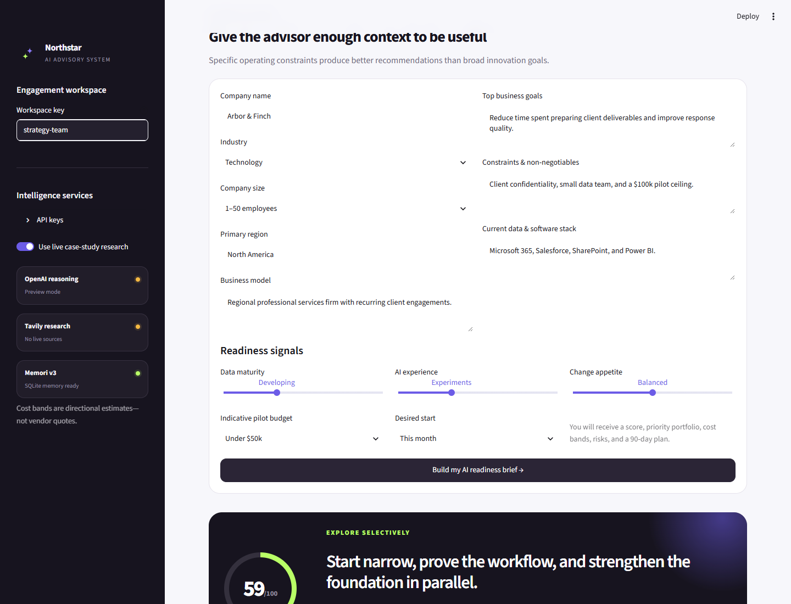
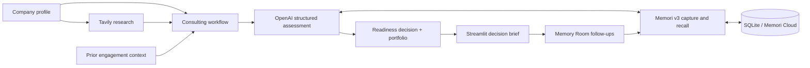

<div align="center">
  
  <h1>AI Consultant Agent with Memory</h1>
  <p><strong>From AI ambition to an evidence-backed, executable 90-day portfolio.</strong></p>

  [](https://tirth1263.github.io/ai-consultant-agent-with-memory/)
  [](https://www.python.org/)
  [](https://streamlit.io/)
  [](https://memorilabs.ai/)
  [](LICENSE)
</div>

---

Northstar is an AI-powered advisory workspace for leaders who need a practical answer to a deceptively hard question: **where should our company actually use AI?**

Instead of returning a generic list of ideas, the agent combines a structured company profile, current case-study research, explicit cost and complexity bands, and context from earlier conversations. The result is a candid readiness decision, three prioritized initiatives, key risks, and a staged 90-day plan.

The project is built with **Streamlit** for the product experience, **OpenAI** for structured consulting reasoning, **Tavily** for web research, and **Memori v3** with SQLite for durable engagement memory.



> [!NOTE]
> The public site opens in an interactive preview mode and requires no keys. The Streamlit app switches to live AI and research as soon as valid API keys are supplied in the sidebar or deployment secrets.

## Why this project is different

Most AI opportunity generators forget the company as soon as the page refreshes and treat every use case as equally promising. Northstar is designed more like a real consulting engagement:

- **Decision before ideation** — recommends “adopt now,” “explore selectively,” or “build foundations first.”
- **A portfolio, not a brainstorm** — returns exactly three ranked initiatives with a KPI and first move.
- **Economics in the room** — includes directional implementation cost, complexity, and time-to-value bands.
- **Evidence with provenance** — Tavily results are preserved as clickable sources beside the synthesis.
- **Continuity across sessions** — Memori attributes model interactions to a privacy-preserving workspace identity.
- **Useful without credentials** — preview mode demonstrates the complete product flow without pretending sample analysis is live research.

## Product experience

### 1. AI readiness assessment

Capture the company’s business model, strategic goals, constraints, software stack, data maturity, AI experience, budget, timeline, and change appetite. Northstar turns those signals into a 0–100 readiness score across strategy, data, technology, and people.

### 2. Prioritized use-case portfolio

Each assessment returns three initiatives chosen for fit and feasibility. Every recommendation includes:

- why it fits the operating context;
- expected impact and implementation complexity;
- a directional USD cost band;
- likely time to value;
- a measurable KPI; and
- the first concrete action.

### 3. Live case-study research

When `TAVILY_API_KEY` is available, the workflow retrieves recent industry examples and implementation lessons before the model makes its recommendation. Sources remain visible in the UI so a user can inspect the evidence rather than accepting an unsupported claim.

### 4. Memori-powered follow-ups

The Memory Room lets a user ask questions such as:

- “Which use case did we rank first, and why?”
- “How do the cost bands compare?”
- “What changes if our budget drops below $50k?”
- “Which earlier recommendation has the fastest time to value?”

Memori v3 instruments the OpenAI client to capture and recall context, while application-owned SQLite tables provide a simple audit index for assessments and chat turns.

## Architecture



| Layer | Responsibility |
| --- | --- |
| `app.py` | Streamlit forms, results dashboard, evidence cards, history, and chat |
| `workflow.py` | Domain model, prompt contract, Tavily retrieval, Memori integration, and persistence |
| Memori v3 | LLM interception, attribution, conversation capture, augmentation, and semantic recall |
| SQLite | Default local BYODB memory store plus auditable assessment/chat index |
| Tavily | Industry case-study and current implementation evidence |
| OpenAI | Structured readiness reasoning and memory-aware follow-up answers |

## Project structure

```text
ai-consultant-agent-with-memory/
├── app.py                    # Streamlit interface (assessment + memory room)
├── workflow.py               # Research, consulting, and Memori workflow
├── Dockerfile                # Portable production container
├── pyproject.toml            # uv project metadata and dependencies
├── uv.lock                   # Reproducible dependency lockfile
├── requirements.txt          # Familiar pip/hosting dependency list
├── .env.example              # Safe environment variable template
├── .streamlit/
│   └── config.toml           # Light product theme and server configuration
├── assets/
│   ├── logo.svg              # Northstar identity mark
│   └── styles.css            # Responsive application design system
├── site/
│   └── index.html            # Public no-key product preview for GitHub Pages
├── tests/
│   └── test_workflow.py      # Preview, persistence, and identity tests
└── memori.sqlite             # Created automatically at runtime; never committed
```

## Quick start with `uv`

### Prerequisites

- Python 3.11 or newer (Python 3.12 is used for the hosted build)
- [`uv`](https://docs.astral.sh/uv/) package manager
- An [OpenAI API key](https://platform.openai.com/api-keys) for live reasoning
- A [Tavily API key](https://app.tavily.com/) for live web research
- A [Memori API key](https://app.memorilabs.ai/) for increased augmentation limits

The app still runs without API keys in clearly labeled preview mode.

### 1. Install `uv`

```bash
# macOS / Linux
curl -LsSf https://astral.sh/uv/install.sh | sh

# or on any platform with Python
pip install uv
```

### 2. Clone and install

```bash
git clone https://github.com/tirth1263/ai-consultant-agent-with-memory.git
cd ai-consultant-agent-with-memory
uv sync
```

`uv sync` creates `.venv`, installs the locked dependencies, and makes the project ready to run.

### 3. Configure the environment

Copy `.env.example` to `.env` and add the services you want to activate:

```env
OPENAI_API_KEY=your_openai_api_key_here
TAVILY_API_KEY=your_tavily_api_key_here
MEMORI_API_KEY=your_memori_api_key_here

# Optional overrides
OPENAI_MODEL=gpt-5-mini
SQLITE_DB_PATH=./memori.sqlite
```

Never commit `.env` or `.streamlit/secrets.toml`. Both are ignored by Git.

### 4. Run the app

```bash
uv run streamlit run app.py
```

Open the URL Streamlit prints, normally `http://localhost:8501` for local development.

## Using the app

1. Choose a memorable but private **workspace key** in the sidebar.
2. Add API keys in the sidebar, deployment secrets, or `.env`. Keys entered in the UI are not persisted.
3. Complete the **Company Profile** and select **Build my AI readiness brief**.
4. Review the readiness decision, dimension scores, use cases, cost bands, risks, research sources, and 90-day roadmap.
5. Download the assessment as JSON for downstream reporting.
6. Open the **Memory Room** and ask follow-up questions using the same workspace key.

## Deployment

### Streamlit Community Cloud

1. Fork or use this public repository.
2. In [Streamlit Community Cloud](https://share.streamlit.io/), create an app from the repository.
3. Set the entrypoint to `app.py` and Python to 3.12.
4. Paste the following into **Advanced settings → Secrets**:

```toml
OPENAI_API_KEY = "..."
TAVILY_API_KEY = "..."
MEMORI_API_KEY = "..."
OPENAI_MODEL = "gpt-5-mini"
SQLITE_DB_PATH = "/tmp/memori.sqlite"
```

The app can also be deployed without secrets; it will remain in preview mode and visitors may enter their own keys per session.

### Docker-compatible hosts

The repository is platform-neutral. A typical start command is:

```bash
streamlit run app.py --server.address 0.0.0.0 --server.port $PORT
```

Or build the included production container:

```bash
docker build -t northstar-ai-advisor .
docker run --rm -p 8501:8501 --env-file .env northstar-ai-advisor
```

For production or multi-instance hosting, replace SQLite with a managed Memori-supported database. Local files on many app hosts are ephemeral and are not appropriate as a durable multi-tenant store.

### Public preview

The no-key companion experience is published through GitHub Pages at:

**[tirth1263.github.io/ai-consultant-agent-with-memory](https://tirth1263.github.io/ai-consultant-agent-with-memory/)**

It demonstrates the product flow safely in the browser. API-backed reasoning, Tavily research, and Memori augmentation run in the Streamlit application because public browser code must never contain service secrets.

## Memory and privacy model

- Workspace keys are transformed into a stable SHA-256-based entity ID before Memori attribution.
- Raw API keys are not written by the app to SQLite, logs, or assessment exports.
- Preview assessments are explicitly marked with `"mode": "preview"`.
- Tavily URLs and snippets are stored with a live assessment to preserve evidence provenance.
- SQLite is suitable for local and single-instance demonstrations, not an authenticated multi-tenant production service.
- Use a managed database, per-user authentication, retention rules, and encryption controls before handling confidential company data.

## Quality checks

```bash
uv run ruff check .
uv run pytest
```

The tests cover deterministic preview output, SQLite persistence, memory follow-up behavior, and stable privacy-preserving workspace attribution.

## Extending Northstar

Useful next additions include PDF executive-brief export, financial ROI modeling, SSO, a managed Postgres/Memori BYODB backend, human scoring calibration, evaluation datasets by industry, and portfolio tracking after the first 90 days.

## Responsible use

Northstar provides directional planning support—not legal, financial, security, procurement, or regulatory advice. Cost bands are rough implementation ranges and should be validated against scope, data readiness, integration constraints, vendor pricing, and governance requirements.

## License

Released under the [MIT License](LICENSE). Built by [Tirth Rank](https://github.com/tirth1263).
